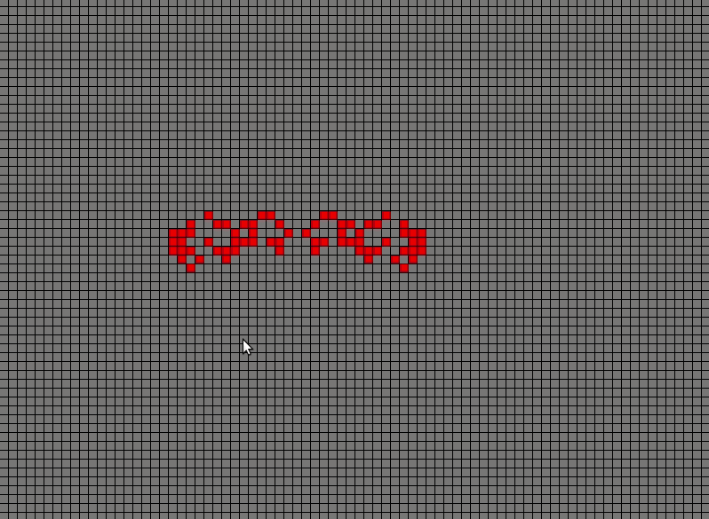

## Conways game of life

- draw game state with your mouse
- run an iteration of the Game of Life by pressing the spacebar
- reset game state by pressing the backspace key

## Build
The build is dependant on SFML
Install SFML on linux
```
sudo apt-get install libsfml-dev
```

Make the game with
```
make game
```

Run the game with 
```
./sfmal-app
```
